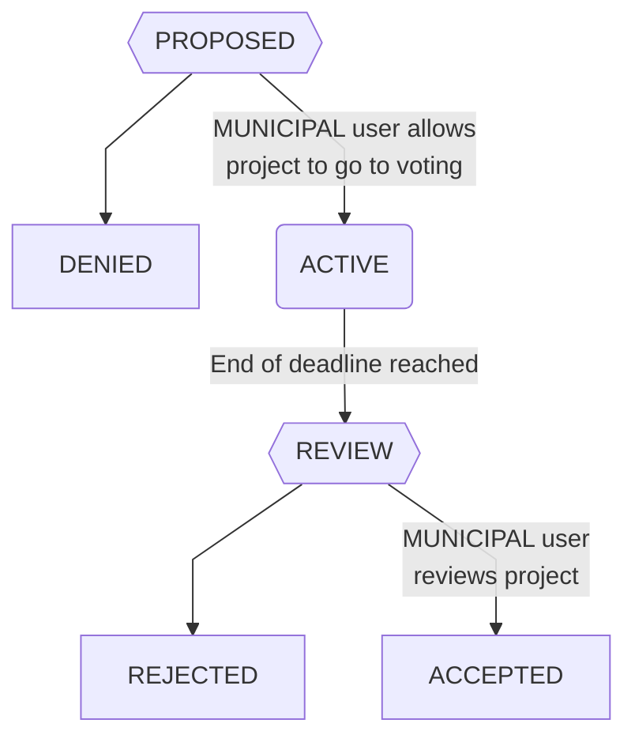

## Status flow:
Entrypoints:
- as CITIZEN the initial stage is PROPOSED
- as MUNICIPAL the initial stage is ACTIVE

```mermaid
%%{init: { "flowchart": { "curve": "linear" } } }%%
flowchart TD
%%    a[EDITING]
    b{{PROPOSED}}
    c[DENIED]
    d(ACTIVE)
    e{{REVIEW}}
    f[ACCEPTED]
    g[REJECTED]
    b --> c
    b -->|"MUNICIPAL user allows 
        project to go to voting"| d
    d -->|"End of deadline reached"| e
    e --> g
    e -->|"MUNICIPAL user
    reviews project"| f
```