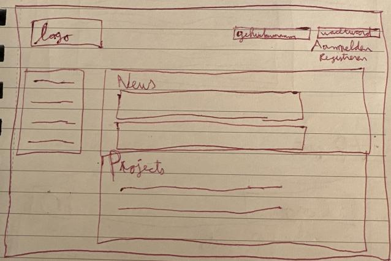
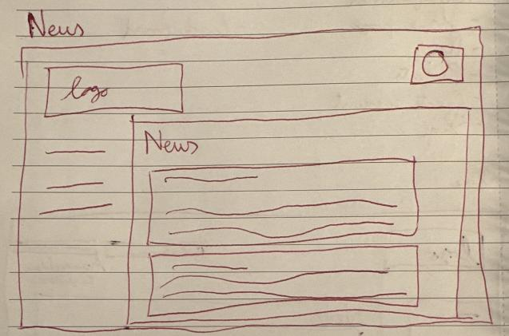
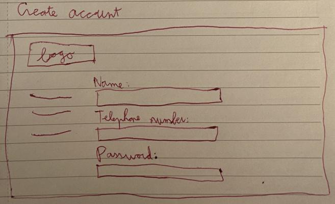
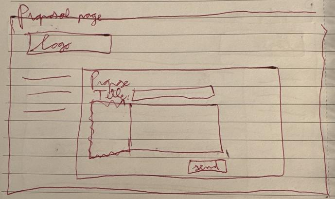
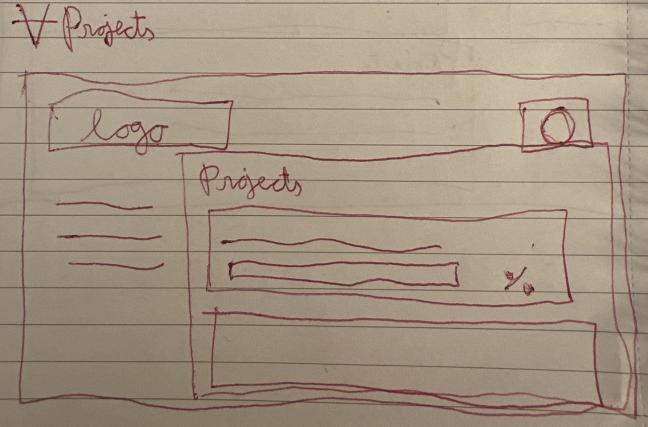
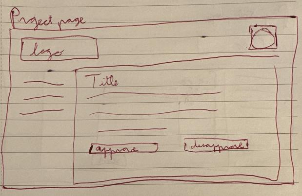

# BieleVote Development Documentation

[**Project proposal**](CitizenVote.pdf)

## Ubiquitous Language Definition

|     Word/phrase      | Definition                                                                                                                                                                     |
|:--------------------:|--------------------------------------------------------------------------------------------------------------------------------------------------------------------------------|
|         user         | A person who interacts with the system via the frontend, there are various types.                                                                                              |
|       account        | All users (except an anonymous visitor) get an account to identify them, comes in various flavours.                                                                            |
|    anonymous user    | A user without an account or someone who hasn't logged in yet. Can view published projects and the news.                                                                       |
| administrative user  | A user who has the power to create and delete user accounts,                                                                                                                   |
|    municipal user    | A user who can publish projects after reviewing, see the results of citizen voting, and publish news articles.                                                                 |
|     citizen user     | A user who can view, propose, comment and vote on projects, view and react to the news.                                                                                        |
|        entity        | A Java object that defines a storage table in the database attached to the backend.                                                                                            |
|       REST API       | The HTTP endpoints made available by the backend to the frontend for data transfer and functionality.                                                                          |
|        token         | A string of characters used by the frontend to gain temporary access to secured parts of the backend API.                                                                      |
|    authorization     | In order to create an account, an administrative user needs to authorize it.                                                                                                   |
|       frontend       | The GUI system that the various users use to interact with the system, written in REACT and accessed via a browser.                                                            |
|       backend        | The Java server that handles data storage, login verification and business logic so that the frontend has actual functionality.                                                |
|    business logic    | The automated data handling done by the backend such as automatically awarding points, spell checking project proposals, and handling shop transactions.                       |
|         news         | Regional news about the municipality, published by municipal and administrative users. A list of articles sorted by publish date.                                              |
|   reacting to news   | All users can react to a news article in the form of: positive, negative or neutral.                                                                                           |
|       project        | A project is a description of how the municipality should handle a certain situation, the contents of this is irrelevant for the implementation of this system.                |
| proposing a project  | A citizen user who has participated in a minimum number (actual amount set by an administrator) of project votes can propose a project to the municipality.                    |
| publishing a project | A municipal user can publish their own project or authorize publishing a project proposed by a citizen user. A published project is visible to every user and can be voted on. |
|    project voting    | All account holders can vote for or against an active project, projects are active (can be voted on) for set amount of time before they go inactive and move to processing.    |
| processing a project | Once a project has gone inactive it gets archived, and sent to the municipality for processing. Successful projects are displayed on the frontend.                             |
|        points        | Rewarded to citizen users for project voting and proposing successful projects, used as a currency to buy rewards.                                                             |
|       rewards        | Available from the award shop, created by the administrative user.                                                                                                             |
|     leaderboard      | A list of citizen users ordered by the amount points gained by votes on their proposed projects.                                                                               |

## User types use case sketches

### Anonymous user

A user who does not have an account (yet), and is able to view the news page and current project page.

|  Word/phrase   | Definition                                                                                                                                                                          |
|:--------------:|-------------------------------------------------------------------------------------------------------------------------------------------------------------------------------------|
| Create account | Creating an account will make this user a citizen. To create an account a username, password, name and phone number is required. Checked if the name and phone number is duplicate. |
|   Read news    | This user is able to ONLY view the news page.                                                                                                                                       |
| View projects  | This user is able to ONLY view the projects page.                                                                                                                                   |

### Citizen user

A user who can view, propose, comment and vote projects, view and react to the news.

|           Word/phrase           | Definition                                                                                                                                                                  |
|:-------------------------------:|-----------------------------------------------------------------------------------------------------------------------------------------------------------------------------|
|        Log into account         | Logging in requires a correct username and password.                                                                                                                        |
|            Read news            | The user is able to read news articles.                                                                                                                                     |
|          React to news          | The user is able to like or dislike news articles.                                                                                                                          |
|      Propose project ideas      | The user is able to propose a project idea after being active on X votings and is limited to X per month. They are able to fill in all the required information via a form. |
|    Comment on project ideas     | The user is able to comment on project ideas.                                                                                                                               |
|     Vote for project ideas      | The user is able to vote on project ideas and see the current progress of the required votes.                                                                               |
|           Get points            | The user is rewarded in points for voting, proposing successful project ideas and overall being an active member.                                                           |
|    Trade points for rewards     | When the user has enough points gathered, they are able to purchase certain rewards in the point-shop                                                                       |
|      Personal shop orders       | The user is able to see the history of orders made by them.                                                                                                                 |
| Be published on the leaderboard | The users who are rewarded the most points are published on a leaderboard, who also have the option to remain anonymous.                                                    |

### Municipal user

A user who can publish projects after reviewing, see the results of citizen voting, and publish news articles. They can
also see the history of orders from the reward shop.

|          Word/phrase          | Definition                                                                                          |
|:-----------------------------:|-----------------------------------------------------------------------------------------------------|
|       Log into account        | Logging in requires a correct username and password.                                                |
|           Read news           | The user is able to read news articles.                                                             |
|         Publish news          | The user is able to publish news articles.                                                          |
|         React to news         | The user is able to like or dislike news articles.                                                  |
| Review proposed project ideas | If the proposal is approved through automatic language check etc, the idea is reviewed by the user. |
|     Publish project ideas     | The user is able to publish project ideas to the main voting page.                                  |
|   Review published projects   | If the voting requirements are realized, the user is able to review the project.                    |
|      Reward shop orders       | The user is able to see the history of orders from the rewards shop.                                |

### Administrator user

A user who has the power to create and delete user accounts. Publish items in the rewards shop and see the history of
orders from the reward shop, and has an entrance to a dashboard of all the results of project ideas.

|          Word/phrase          | Definition                                                                                          |
|:-----------------------------:|-----------------------------------------------------------------------------------------------------|
|       Log into account        | Logging in requires a correct username and password.                                                |
|        Create accounts        | This user is able to create citizen user accounts and municipal user accounts.                      |
|           Read news           | The user is able to read news articles.                                                             |
|         Publish news          | The user is able to publish news articles.                                                          |
|         React to news         | The user is able to like or dislike news articles.                                                  |
| Review proposed project ideas | If the proposal is approved through automatic language check etc, the idea is reviewed by the user. |
|     Publish project ideas     | The user is able to publish project ideas to the main voting page.                                  |
|   Review published projects   | If the voting requirements are realized, the user is able to review the project.                    |
|       Result dashboard        | The user is able to see the results of previous projects.                                           |
|      Reward shop orders       | The user is able to see the history of orders from the rewards shop.                                |
|       Manage shop items       | The user is able to publish or delete reward shop items.                                            |

## Frontend wireframes

### Home page

### News page

### Create account page

### Project editor/proposal page

### Published projects overview page

### Project view/voting page

## Project libraries

|   Library name   | Justification for use                                                     |
|:----------------:|---------------------------------------------------------------------------|
|        H2        | Postgres uses too much RAM to run on a system with only 8GB.              |
| Spring REST Docs | Seems like it might be useful, if it doesn't take too much effort to use. |
| Tailwind+PostCSS | There was already experience with this styling method for the frontend.   |
|   Semantic-UI    | It makes the REACT code of the frontend more legible.                     |
|      Axios       | Simplifies API interactions for the REACT frontend.                       |
|   react-icons    | Clean looking icons with minimal fuss.                                    |
